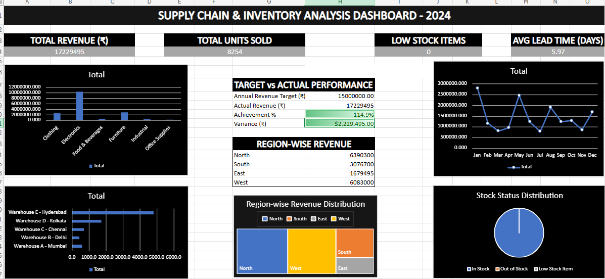

# 📦 Supply Chain & Inventory Analysis Dashboard

## Overview
An interactive Excel dashboard analyzing supply chain & 
inventory data across 5 warehouses, 6 categories, and 8 suppliers.

## Features
- 📊 KPI Summary (Revenue, Units Sold, Lead Time, Stock Status)
- 🔄 4 PivotTables with Slicers
- 📈 Interactive Dashboard with Charts (Bar, Line, Pie, Treemap)
- 🎯 Target vs Actual Performance Tracking
- 🌍 Region-wise Revenue Analysis
- ⚠️ Reorder Alert System

## Tools Used
Microsoft Excel (Online) - Formulas, PivotTables, Conditional Formatting, Charts

## Screenshots
[Add dashboard screenshot here]

## Skills Demonstrated
SUMIF, AVERAGEIF, COUNTIF, PivotTables, Data Visualization, 
Dashboard Design, Business Analysis
## 📸 Dashboard Preview

